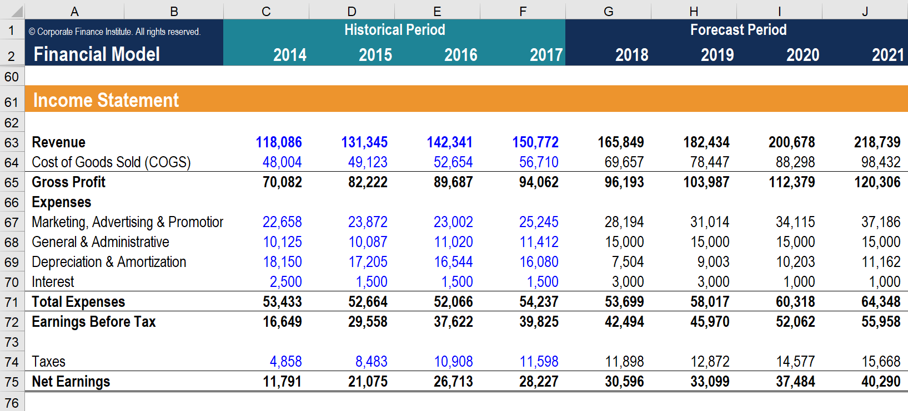

>## *Automating Financial Reporting for Small Businesses*   
#

 

#

#

>### Overview: 
>> This script will *Evaluate* & *Automate*  financial reporting efforts.

>> This open source script can help any business owner visualize how Python can help their small business.

>> Python can help a Company be more efficient with their resources and focus manual effort on more complicated tasks, reducing overhead & salary costs, for example. 

>### How can Python support your small business?
> [Data Science](https://medium.com/@sayonetech/why-is-python-important-for-business-analytics-2b5dc63e83ef): Python is replacing excel spreadsheets, and it is primarily due to the inability of MS-excel to provide the scalability that modern business needs. Python has emerged as a potential data processing and management solution for creating applications that help businesses to make sense of their data.

>### Python with Financial Reporting:
> [BitDegree](https://www.bitdegree.org/tutorials/python-for-finance/#:~:text=Python%20in%20finance%20is%20the%20leading%20programming%20language,of%20return%20of%20stocks%20and%20so%20much%20more.): Python in finance is the leading programming language for performing quantitative and qualitative analysis. This language is involved in the development of payment and online banking solutions, in the analysis of the current stock market situation, in reducing financial risks, in determining the rate of return of stocks and so much more.

>

 

## Resources:
1. Northwestern NPS:
https://sps.northwestern.edu/

2. Using Python in Finance:
https://www.bitdegree.org/tutorials/python-for-finance/#:~:text=Python%20in%20finance%20is%20the%20leading%20programming%20language,of%20return%20of%20stocks%20and%20so%20much%20more.

3. Algorithmic Factor Investing (Medium):
https://medium.com/@sayonetech/why-is-python-important-for-business-analytics-2b5dc63e83ef
